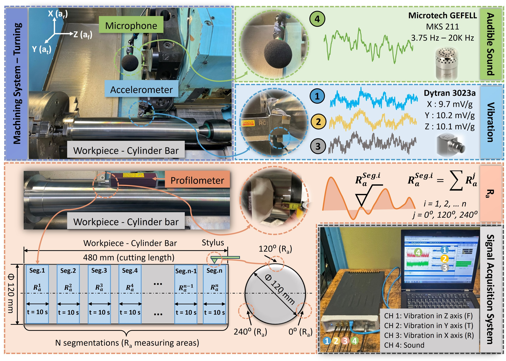
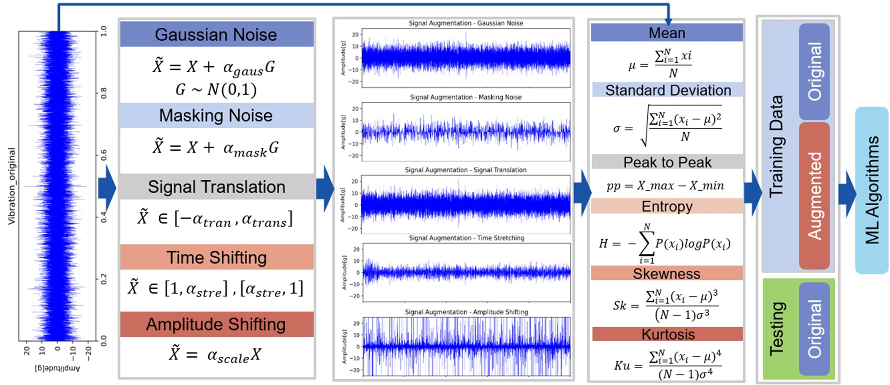

<h1 align="center">Hej, Moi, 👋, I'm Yaoxuan (Seven) Zhu</h1>

<h3 align="center">
  MLOps Engineer &nbsp;|&nbsp; ML Engineer &nbsp;|&nbsp; Data Scientist 
  Building production-grade ML systems from data pipelines to deployment & monitoring in the context of engineering applicaiton
</h3>

  
  
    
  

  <i>Open to Data Scientist · ML Engineer · MLOps Engineer · Data Engineer opportunity

---

## 🧠 About Me

I'm a **PhD researcher & MLOps Engineer** at KTH Royal Institute of Technology (Stockholm) with **5+ years of end-to-end ML experience** — from raw sensor data to production APIs monitored 24/7.

My core focus is building **intelligent process monitoring systems** that fuse multi-modal signals (vibration + acoustics) to predict surface quality in real-time manufacturing. I treat every model as a product: versioned, containerized, tested, and observable.

- 🔬 **Research**: Multimodal deep learning, LLMs for time-series, Vision Transformers, Diffusion Models for data augmentation
- ⚙️ **Engineering**: End-to-end MLOps (MLflow, Docker, Kubernetes, GitHub Actions, Evidently, Grafana)
- ☁️ **Cloud**: AWS (SageMaker, S3, Lambda, Kinesis, Step Functions), GCP, Azure Databricks
- 📦 **Currently**: Part-time ML Engineer @ NordML — demand forecasting system for Nudient AB on GCP
- 📍 Stockholm, Sweden

---

## 🚀 What I Bring to DS / MLE / MLOps Roles

| Area | What I've Done |
|---|---|
| **Data Science** | Feature engineering on time-series signals; statistical & automated extraction; multimodal fusion; uncertainty quantification |
| **ML Engineering** | Trained & fine-tuned CNNs, ViTs, LLMs (LoRA/QLoRA), diffusion models; 15%+ error reduction vs. baselines; 95%+ accuracy in production |
| **MLOps** | MLflow tracking + model registry; Docker + Kubernetes deployments; CI/CD with GitHub Actions; drift detection with Evidently; dashboards in Grafana |

---

## 🛠️ Tech Stack

### 🤖 ML / DL

> **Specialties**: LLMs (LoRA/QLoRA fine-tuning) · Vision Transformers (ViT) · CNNs (VGG, ResNet, InceptionResNet) · GANs · Diffusion Models · LSTM / RNN · NLP Transformers · SVM / RF / GBR

### ⚙️ MLOps & Engineering

### ☁️ Cloud & Data

---

## 💼 Experience Highlights

### 🎓 Full-stack Data Scientist — KTH Royal Institute of Technology *(Nov 2019 – Present)*
> *End-to-end intelligent process quality monitoring system*

- Built a **multimodal ML pipeline** fusing vibration + acoustic signals to predict surface roughness in real time
- Achieved **>15% error reduction** vs. single-sensor baselines via ensemble fusion with attention mechanisms
- Productionized with **MLflow + Docker + Kubernetes + GitHub Actions CI/CD**; drift detection via **Evidently**; real-time dashboards in **Grafana**
- Deployed both **batch and low-latency REST APIs**; enforced data contracts for governed, auditable releases

### 🏢 ML Engineer (Part-time) — NordML / Nudient AB *(June 2025 – Present)*
> *Inventory demand forecasting system*

- Built multi-SKU demand forecasting models with Shopify data pipelines, feature engineering, and **DVC** versioning
- Deployed batch + real-time inference on **GCP** with Docker + CI/CD
- Monitored via **Grafana** with MAPE, service level, and fill rate alerts tied to safety-stock replenishment

### 🔧 Project Engineer — Sandvik Coromant AB *(Aug 2018 – Feb 2019)*
> *ML-based milling runout & tool life prediction*

- Developed **SVR, ANN, LR** models on vibration time-series to predict tool wear impact from milling runout
- End-to-end responsibility: data collection → preprocessing → modeling → presentation at R&D monthly conference

---

## 📂 Featured Projects

### 🤖 LLM for Surface Quality Prediction *(Dec 2024 – Present)*
Fine-tuned **ChatGLM2** with **LoRA/QLoRA** for surface quality prediction from textualized vibration features.
Improved cross-dataset accuracy by **10%**; strong results in zero-shot and small-sample scenarios.

### 🎨 Data Augmentation with Diffusion Models *(Jan 2024 – Nov 2024)*
Applied **Conditional GANs & Classifier-Guidance Diffusion Models** to synthesize training images.
📄 *Published in [Procedia CIRP, 58th CIRP Conference on Manufacturing Systems](https://doi.org/10.1016/j.procir.2025.02.207)*

### 🔭 Vision Transformer for Process Monitoring *(Jun 2023 – May 2024)*
Modified & fine-tuned **ViT** with multiple attention mechanisms for multimodal surface quality prediction.
📄 *Under review — Journal of Advanced Engineering Informatics*

### 🔄 Deep Transfer Learning for In-Process Monitoring *(Feb 2022 – Feb 2023)*
Leveraged pre-trained CNNs (VGG16/19, ResNet50V2, InceptionResNetV2) on audio data; hyperparameter tuning with **Bayesian Optimization**.
📄 *Published in Journal of Manufacturing Letters*

### 🏭 Robust Hard Turning — Vinnova 3.5M SEK Project *(Feb 2019 – Apr 2021)*
Industrial collaboration with **Volvo Truck, Sandvik, Swerim AB** — deployed models achieving **95%+ accuracy, R² > 0.98** for surface quality prediction.
📄 *Published in Journal of Engineering Applications of Artificial Intelligence*

---

## 🎓 Education

| Degree | Institution | Period |
|---|---|---|
| 🎓 **Ph.D.** — Intelligent Manufacturing (ML Monitoring Systems) | <a href="https://www.kth.se/en" target="_blank"> KTH Royal Institute of Technology, Sweden</a> | 2019 – Present |
| 🎓 **M.Sc.** — Production Engineering | <a href="https://www.kth.se/en" target="_blank"> KTH Royal Institute of Technology, Sweden</a> | 2015 – 2018 |
| 🎓 **M.Sc.** — Computer Science (Minor) | <a href="https://www.aalto.fi/en" target="_blank"> Aalto University, Finland</a> | 2015 – 2018 |
| 🎓 **B.Sc.** — Mechanical Engineering | <a href="https://www.savonia.fi/en/" target="_blank"> Savonia University of Applied Sciences, Finland</a> | 2012 – 2015 |

---

## 📝 Selected Publications

> 💡 **Setup note**: Export the overview figure from each paper PDF → save as `paper_images/paper1.png` ... `paper5.png` in this repo to display the images below.

---

### 1 · Diffusion Model for Data-Augmented Surface Roughness Prediction

**Leveraging classifier-guidance diffusion model for improved surface roughness prediction through synthesized audible sound signal**

📰 *Procedia CIRP, 58th CIRP Conference on Manufacturing Systems, 2025*
&nbsp;|&nbsp; 🔗 [Open Access — CC BY](https://www.sciencedirect.com/science/article/pii/S2212827125005815)

> Applied a classifier-guided diffusion model to synthesize 2D Mel-spectrogram images of audible sound signals from machining, tackling data scarcity in deep learning-based monitoring. Synthetic + real data boosted VGG16 prediction accuracy and generalization on enriched datasets.

**Key topics**: `Diffusion Model` `Data Augmentation` `Transfer Learning` `VGG16` `Mel-spectrogram` `Surface Roughness`

  

---

### 2 · Deep Transfer Learning for In-Process Surface Quality Monitoring

**Surface quality prediction in-situ monitoring system: A deep transfer learning-based regression approach with audible signal**

📰 *Journal of Manufacturing Letters, 2024*
&nbsp;|&nbsp; 🔗 [Open Access — CC BY](https://doi.org/10.1016/j.mfglet.2024.09.156)

> Built an in-process surface roughness monitoring system using pre-trained CNNs (VGG16, VGG19, ResNet50V2, InceptionResNetV2) on Mel-spectrogram images of audible sound. Model architectures fine-tuned via Bayesian optimization; compared across multiple input window lengths.

**Key topics**: `Transfer Learning` `CNN` `Bayesian Optimization` `Audible Sound` `Mel-spectrogram` `In-process Monitoring`

  

---

### 3 · Multi-channel Data-driven Monitoring for Hard Part Turning

**Data-driven approaches for surface quality monitoring and prediction based on heterogeneous multi-channel signal fusion in hard part machining**

📰 *Journal of Engineering Applications of Artificial Intelligence, 2025*
&nbsp;|&nbsp; 🔗 [Open Access — CC BY](https://doi.org/10.1016/j.engappai.2025.111865)

> A comprehensive methodology evaluating signal selection, multi-sensor fusion, and ML model deployment for hard turning. Validated on two machining platforms; includes uncertainty quantification (NPKDE-based prediction intervals) and Bayesian hyperparameter tuning.

**Key topics**: `Multi-sensor Fusion` `Hard Turning` `ML Models` `Uncertainty Quantification` `Bayesian Optimization` `Feature Engineering`

  

---

### 4 · Feature Extraction Methods Comparison for Turning Process Monitoring

**Surface roughness monitoring and prediction based on audible sound signal with the comparison of statistical and automatic feature extraction methods in turning process**

📰 *Euspen's 24th International Conference & Exhibition, 2024*
&nbsp;|&nbsp; 🔗 [Open Access — CC BY](https://www.euspen.eu/resource/surface-roughness-monitoring-and-prediction-based-on-audible-sound-signal-with-the-comparison-of-statistical-and-automatic-feature-extraction-methods-in-turning-process/)

> Benchmarked statistical (handcrafted) vs. automated feature extraction methods applied to audible sound signals for surface roughness prediction in CNC turning. Provided clear guidance on feature strategy selection for practical deployment.

**Key topics**: `Feature Engineering` `Automated Feature Extraction` `Signal Processing` `Turning Process` `Time-series Analysis`

  

---

### 5 · Vision Transformer with Bottleneck Attention for Multimodal Monitoring

**A multi-modality transformer approach: surface roughness monitoring and prediction with bottleneck attention mechanisms**

📰 *Under Review — Journal of Advanced Engineering Informatics*

> Modified and fine-tuned Vision Transformer (ViT) models combined with multiple bottleneck attention mechanisms for surface roughness prediction under multimodal information fusion (vibration + acoustic). Benchmarked across multiple fusion scenarios.

**Key topics**: `Vision Transformer (ViT)` `Attention Mechanisms` `Multimodal Fusion` `Deep Learning` `Surface Quality Prediction`

  

---

### 6 · Data augmenation methods for improved surface quality monitoring and prediction

**Data augmenation based surface quality monitoring with machine learning models**

📰 *Oral presentation as the invited speaker at Digital Cluster Conference, Stockholm, 10-05-2023*

&nbsp;|&nbsp; 🎥 [Video Link](https://kunskapsformedlingen.se/en/partners-and-collaborations/session-digital-manufacturing/)

> Modified and fine-tuned Vision Transformer (ViT) models combined with multiple bottleneck attention mechanisms for surface roughness prediction under multimodal information fusion (vibration + acoustic). Benchmarked across multiple fusion scenarios.

**Key topics**: `Data Augmentation` `Signal Synthesis` `ML Algorithms` `Surface Roughness Prediction` `Audible Sound`

  

---

## 📊 GitHub Stats

  
  &nbsp;
  

  

  
